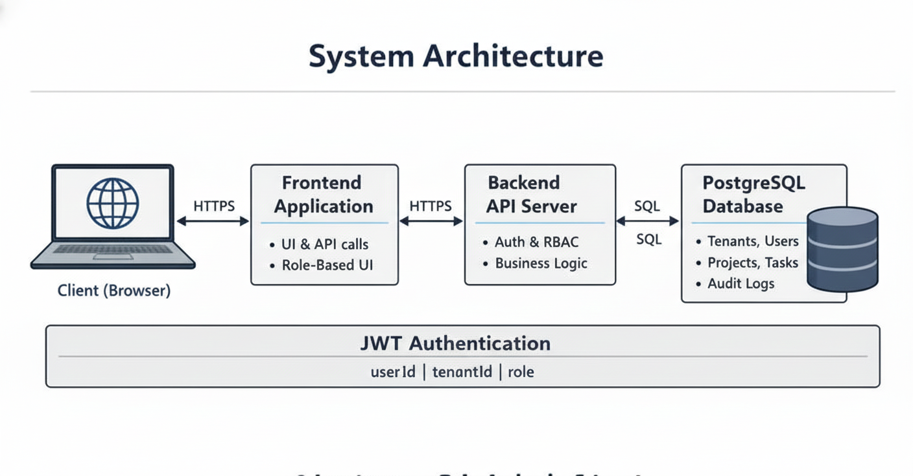

# Multi-Tenant SaaS Platform (Project & Task Management)

## 📖 Project Description
A production-ready, multi-tenant SaaS application designed for organizations to independently register, manage teams, create projects, and track tasks. The platform ensures strict data isolation between tenants using a **Shared Database, Shared Schema** architecture. It features Role-Based Access Control (RBAC), subscription-based resource limits, and a fully Dockerized deployment pipeline.

**Target Audience:** Small to medium-sized businesses (SMBs) looking for an isolated, secure project management workspace.

---

## 🚀 Features
1.  **Multi-Tenancy:** Complete data isolation using `tenant_id` row-level security for every record.
2.  **Secure Authentication:** JWT-based stateless authentication with secure password hashing.
3.  **Role-Based Access Control (RBAC):** Three distinct roles: 
    * **Super Admin:** System-level administrator with global access.
    * **Tenant Admin:** Organization admin with full control over their tenant.
    * **User:** Regular team member with limited permissions.
4.  **Project Management:** Create and manage projects with subscription limit enforcement.
5.  **Task Management:** Task tracking with status updates (Todo, In Progress, Completed) and priority levels.
6.  **Subscription Plans:** Enforced limits on users and projects per plan (Free, Pro, Enterprise).
7.  **Automated Onboarding:** Self-service registration that automatically provisions new tenants.
8.  **Dockerized Deployment:** One-command setup for Database, Backend, and Frontend.
9.  **Audit Logging:** Tracks critical actions like user creation and project updates.

---

## 🛠️ Technology Stack

### Frontend
* **Framework:** React.js
* **Visualization:** Recharts for dashboard analytics
* **API Client:** Axios with JWT interceptors

### Backend
* **Language:** Python 3.9+
* **Framework:** FastAPI
* **ORM:** SQLAlchemy
* **Authentication:** JWT (JSON Web Tokens)

### Database
* **Database:** PostgreSQL
* **Strategy:** Shared Database, Shared Schema (Tenant ID column)

### DevOps
* **Containerization:** Docker & Docker Compose

---

## 🏗️ Architecture Overview

The application utilizes a **Shared Database, Shared Schema** architecture to maximize resource efficiency while maintaining logical isolation.

* **Request Flow:** Client -> Frontend (React) -> Backend (FastAPI) -> Database (PostgreSQL).
* **Isolation:** Every table (except `tenants`) contains a `tenant_id` column.
* **Middleware:** A custom authentication middleware extracts the `tenant_id` from the JWT and ensures all queries are filtered by that ID, preventing cross-tenant data leaks.



*(Note: View the full architecture diagram in docs/architecture.md)*

---

## 📦 Installation & Setup

### Prerequisites
* [Docker Desktop](https://www.docker.com/products/docker-desktop/) installed and running.
* Git installed.

### Option 1: Docker Setup (MANDATORY for Evaluation)
This is the required way to run the application. It handles Migrations, Seeding, Backend, and Frontend automatically.

1.  **Clone the Repository**
    ```bash
    git clone <your-repository-url>
    cd <repository-folder>
    ```

2.  **Start the Application**
    **for Running the both backend and frontend :**
    ```bash
    docker-compose up --build
    ```
    or

    ```bash
    docker-compose up -d --build
    ```
    *This command starts the `database` (5432), `backend` (5000), and `frontend` (3000) services*.

3.  **Access the App**
    * **Frontend:** [http://localhost:3000](http://localhost:3000)
    * **Backend Health Check:** [http://localhost:5000/api/health](http://localhost:5000/api/health)
    * **Swagger API Docs:** [http://localhost:5000/docs](http://localhost:5000/docs)

4.  **Stop the Application**
    ```bash
    docker-compose down
    ```

### Option 2: Local Setup (Manual)
If you wish to run without Docker, follow these steps.

**1. Database Setup**
* Install PostgreSQL locally and create a database named `saas_db`.
* Run the migration scripts and the seed file located in the database folder.

**2. Backend Setup**
```bash
cd backend
python -m venv venv
source venv/bin/activate  # On Windows: venv\Scripts\activate
pip install -r requirements.txt
uvicorn app.main:app --port 5000